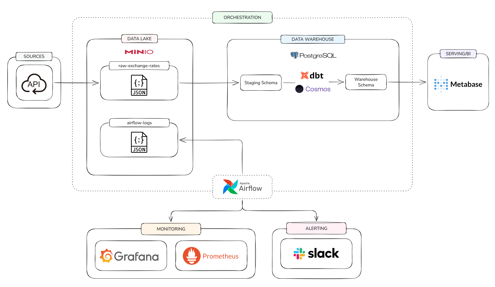
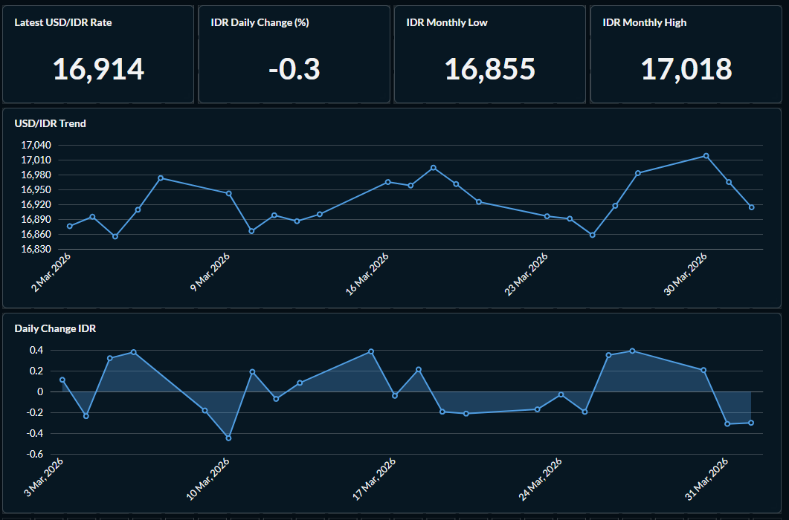

# Exchange Rate Monitor

Hello, welcome to my learning logs!

In this project, I explored something new by building an ELT pipeline that simulates how a company might monitor daily exchange rates. The pipeline extracts data from the Frankfurter API, stores raw data in MinIO, loads it into a PostgreSQL data warehouse, transforms it with dbt (orchestrated via Cosmos), and serves analytics through a Metabase dashboard. Everything is scheduled and monitored with Airflow, with failure alerts sent to Slack and Airflow metrics visualized in Grafana.

I hope you find something useful and can learn from this repository!

&nbsp;

## Architecture



&nbsp;

## Dashboard



&nbsp;

## Tech Stack

| Layer | Tool |
|-------|------|
| Data Source | Frankfurter API |
| Data Lake | MinIO |
| Data Warehouse | PostgreSQL |
| Transformation | dbt + Astronomer Cosmos |
| Orchestration | Apache Airflow 2.10.4 |
| Dashboard | Metabase |
| Monitoring | StatsD + Prometheus + Grafana |
| Alerting | Slack |
| Containerization | Docker Compose |

&nbsp;

## How It Works

The pipeline runs daily on weekdays and follows an ELT pattern: Extract from API, Load into staging, Transform with dbt.

### Extract

Airflow calls the Frankfurter API for the latest USD exchange rates against IDR, EUR, SGD, JPY, and MYR. The raw JSON response is stored in MinIO (S3-compatible object storage) partitioned by date. This raw layer acts as an archive. If the transform logic changes later, you can always reprocess from the original data without calling the API again.

### Load

A second task reads the JSON from MinIO, parses it into one row per currency, and upserts it into a PostgreSQL staging table. Upsert (INSERT ON CONFLICT UPDATE) makes this idempotent. Running the same day twice does not create duplicate rows.

### Transform

dbt reads from the staging table and builds a star schema in the warehouse:

- **dim_date** generated date dimension with year, month, day, day of week, and weekend flag
- **dim_currencies** seeded reference table (USD, EUR, IDR, SGD, JPY, MYR)
- **fact_exchange_rates** one row per currency per business day, with the previous day rate, daily change, and daily change percentage calculated using a window function

Cosmos orchestrates dbt inside Airflow, turning each dbt model into its own Airflow task. If `fact_exchange_rates` fails, you can see it directly in the Airflow graph view without reading through logs.

### Monitoring and Alerting

If any task fails, a Slack message is sent automatically with the DAG name, failed task, and a link to the logs. Airflow also sends metrics to StatsD, which Prometheus scrapes and Grafana visualizes. This gives you dashboards for scheduler health, DAG run duration, and task success/failure rates.

&nbsp;

## Project Structure

```
├── docker-compose.yml              # All services in one file
├── .env                            # Credentials (not committed)
├── docker/
│   ├── airflow/Dockerfile          # Airflow + dbt + Cosmos
│   └── monitoring/
│       ├── grafana/                # Dashboard provisioning + JSON dashboards
│       ├── prometheus/             # Scrape config
│       └── statsd/                 # Airflow metric mappings
├── dags/
│   ├── exchange_rate_pipeline.py   # Airflow DAG
│   ├── extract.py                  # API → MinIO
│   ├── load.py                     # MinIO → PostgreSQL staging
│   └── alert.py                    # Slack failure callback
├── dbt/
│   ├── dbt_project.yml
│   ├── profiles.yml
│   └── models/
│       ├── staging/                # Source declaration + staging view
│       └── warehouse/              # dim_date, fact_exchange_rates
├── config/
│   ├── airflow-connections.yml     # Airflow connections (import file)
│   └── airflow-variables.json      # Airflow variables (import file)
├── sql/
│   └── init.sql                    # Warehouse schema + seed data
├── pyproject.toml                  # Local dev dependencies (uv)
└── images/                         # Architecture diagram + dashboard screenshot
```

&nbsp;

## Getting Started

### Prerequisites

- Docker and Docker Compose
- Python 3.12+ with [uv](https://github.com/astral-sh/uv) (for local development)
- A Slack workspace with a bot token (for failure alerts)
- Around 8GB RAM for Docker

&nbsp;

### 1. Clone and configure

```bash
git clone https://github.com/<your-username>/exchange-rate-monitor.git
cd exchange-rate-monitor
```

Create a `.env` file in the project root. All services read credentials from this file:

```env
AIRFLOW_UID=50000
AIRFLOW_ADMIN_USER=airflow
AIRFLOW_ADMIN_PASSWORD=airflow123
AIRFLOW_FERNET_KEY=<generate-your-own>
AIRFLOW_WEBSERVER_SECRET_KEY=<generate-your-own>

AIRFLOW_DB_USER=airflow
AIRFLOW_DB_PASSWORD=airflow123
AIRFLOW_DB_NAME=airflow_metadata
AIRFLOW_DB_PORT=5433

DWH_POSTGRES_DB=exchange_rate_dwh
DWH_POSTGRES_USER=postgres
DWH_POSTGRES_PASSWORD=postgres123
DWH_POSTGRES_PORT=5434

MINIO_ROOT_USER=minio
MINIO_ROOT_PASSWORD=minio123
MINIO_API_PORT=9200
MINIO_CONSOLE_PORT=9201

GRAFANA_USER=grafana
GRAFANA_PASSWORD=grafana123
GRAFANA_PORT=3000
PROMETHEUS_PORT=9090

METABASE_PORT=4000
```

&nbsp;

### 2. Start all services

```bash
docker compose up -d --build
```

First run takes a few minutes to build the Airflow image and download other images. Check that everything is healthy:

```bash
docker compose ps
```

&nbsp;

### 3. Import Airflow connections and variables

```bash
docker exec airflow-webserver airflow connections import /opt/airflow/config/airflow-connections.yml
docker exec airflow-webserver airflow variables import /opt/airflow/config/airflow-variables.json
```

&nbsp;

### 4. Enable and trigger the pipeline

Open [Airflow](http://localhost:8080) (login with credentials from `.env`). Toggle on the `exchange_rate_pipeline` DAG and trigger a run. The pipeline runs: extract → load → dbt transform.

&nbsp;

### 5. Backfill historical data (optional)

To populate the dashboard with more than one day of data:

```bash
docker exec airflow-scheduler airflow dags backfill exchange_rate_pipeline \
    --start-date 2026-03-01 --end-date 2026-03-31
```

&nbsp;

### 6. View the dashboard

Open [Metabase](http://localhost:4000). On first launch, create an admin account. Add a PostgreSQL connection:

- Host: `exchange-rate-dwh`
- Port: `5432`
- Database: `exchange_rate_dwh`
- Username: `postgres`
- Password: `postgres123`

&nbsp;

## Services

| Service | URL |
|---------|-----|
| Airflow | [localhost:8080](http://localhost:8080) |
| MinIO Console | [localhost:9201](http://localhost:9201) |
| Metabase | [localhost:4000](http://localhost:4000) |
| Grafana | [localhost:3000](http://localhost:3000) |
| Prometheus | [localhost:9090](http://localhost:9090) |

&nbsp;

## Acknowledgements

Thank you for checking out this project. If you have any questions or feedback, feel free to reach out.

You can connect with me on:

- [LinkedIn](https://linkedin.com/in/<ricofebrian>)
- [Medium](https://medium.com/@ricofebrian731)